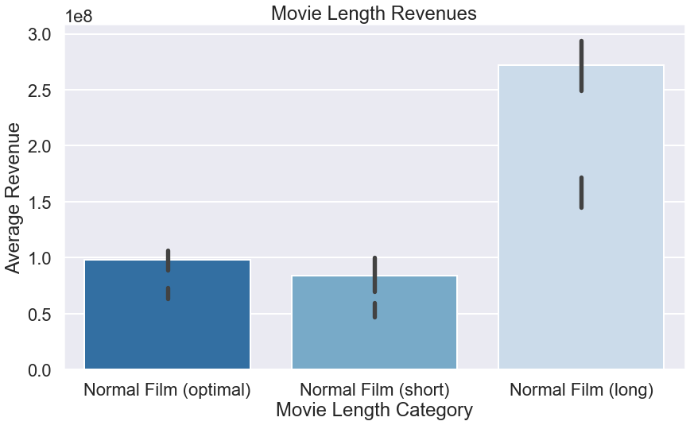
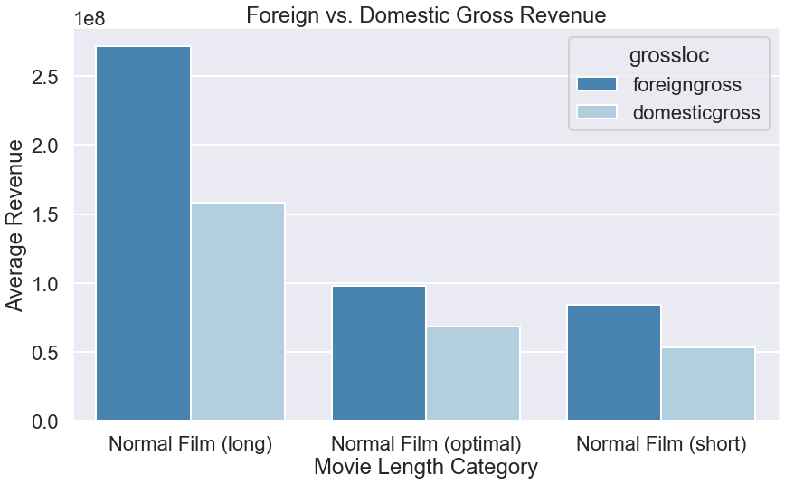
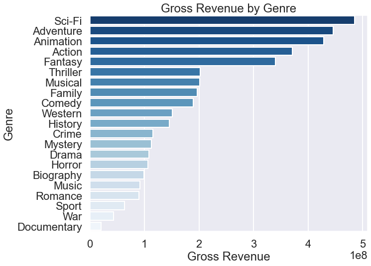

# Movie Analysis

#### Students; William Bennett, Alex Karadjov
#### Teacher: David Elliot
#### Project Due Date: May 12th

## Project Overview
### For this project, we will need to use exploratory data analysis to generate insights for a sucessful movie production.

### Business Undertanding

#### Business Question
- Your company has now seen all the other big companies creating original video content. 
- Your companies board have decided to create a new movie studio, but they don’t know anything about creating movies.

#### Business Proposal
- We are _charged_ with exploring what types of films are currently doing the **best at the box office**.
- We then _translate_ those findings into **undstandable** and **logistical** formats
- All inorder to give an insightful **conclusion** on what type of films are the _best to be creating_.

#### The _best_ at the box office.
What does **best** mean:
- money
- rating, won’t line pockets
- consistency

### The Data

In the folder `zippedData` are movie datasets from:

* [Box Office Mojo](https://www.boxofficemojo.com/)
* [IMDB](https://www.imdb.com/)
* [Rotten Tomatoes](https://www.rottentomatoes.com/)
* [TheMovieDB](https://www.themoviedb.org/)
* [The Numbers](https://www.the-numbers.com/)

### Ingesting Data
#### Creating DataFrames

##### IMDB Movie Data Frame
- First we import the IMDB SQL Data Base, then the BOX Movie Gross Data Base.
- We then create a single data frame withonly the columns we want from each of the data bases combining them

### Data Cleaning
Our main focuses while cleaning will be;

##### Gross based;
- Remove non US dollar value column
- Change Null Values to -99999 to create visible outlier

##### Avgerage Rating based;
- Remove rows from the column avgeragerating if the column numvotes has a row with less than 30 votes
- Drop null values for both columns

##### Genre based;
- Seperate multiple genre movies
- Drop null values

##### Run Time Minutes based;
- Handle outliers with long runtimes 
- Drop null values

##### Null Values based;
- Drop and replace values that mean nothing based on significance for all significant data used
- Region, Studio, Year

### Visuals
After Cleaning through and inspecting the data we were able to come up with these visualizations for what we think our business recomendations should be based on our findings.

#### Movie Length Revenues:

#### Domestic Vs. Foriegn Gross for Different Film Lengths:

#### Gross Revenue by Genre 

### Business Conclusions

#### One; 
Have a longer movie runtime because long films have the highest grossing, a long film is again ideally over 120 minutes

#### Two; 
to have a successful movie you will want a good rating which improves your movies revenue

#### Three; 
Create a movie in a successful genre category ideally; Sci Fi, Adventure, Animation, Action or Fantasy as these are the highest grossing genres

### Next Steps
#### If we had more time for this project we would look into the;

##### ROI:
Return on investment, to determine if the cost of the movie isn’t worth the production or revenue 

##### International: 
All money values we had were in unknown currencies, we’d like to convert them all to USD so we could compare 

##### Recency: 
Our data was from 2010-2019 and the movie industry was affected by the COVID-19 pandemic, we’d like to investigate recent years as well to see if there have been any changes

##### Launch date: 
We compared movies from different years, however inflation and the amount of time a movie all have effects on box office sales

